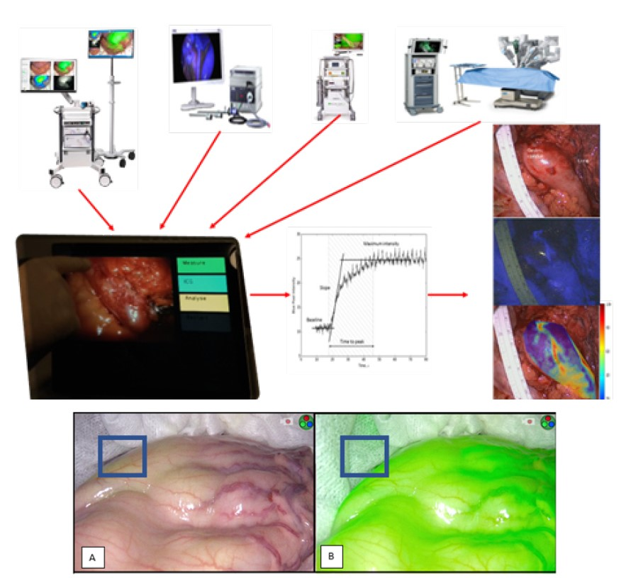

<p align="center"></p>

This repository contains the MAIDS description for project U21-01. It was built by cloning the [MAIDS-Template](https://github.com/PERSIMUNE/MAIDS-Template). You will find more details about this dataset below with links to visit the website and download the PDF.

>MAIDS is currently being prototyped for the [Copenhagen Ultrathon on Precision Medicine](https://ultrathon.online) where you will find more information about the event. You may also be interested in viewing other examples listed in the 2021 Ultrathon [Project Pool](https://github.com/UltrathonOnline/U21-PROJECT-POOL).

There are several ways to stay informed:
* Visit the Ultrathon's [landing page](https://ultrathon.online) and sign up to the mailing list.
* Follow us on [Twitter](https://twitter.com/UltrathonOnline).
* Watch the repository for changes.

---

### **U21-02:** Fluorescence angiography
<p align="center"></p>

>Visit the [website](https://ultrathononline.github.io/MAIDS.U21-02.Florescence_angiography/) for this dataset or download the formatted [PDF](./docs/maids.pdf).
```
Michael Achiam, Morten Bo Svendsen, Lars Bo Svendsen, Nikolaj Nerup, Jens Osterkamp
@: Rigshospitalet, Copenhagen, Denmark

The purpose was to offer quantities of videos to enable the development of motion correction algorithms
for subsequent data acquisition. The algorithm/program should be able to accurately adjust which pixels
are sampled within each frame to keep a Region-of-Interest within the target area and, thus, produce a
more sensitive and accurate quantification.
```
